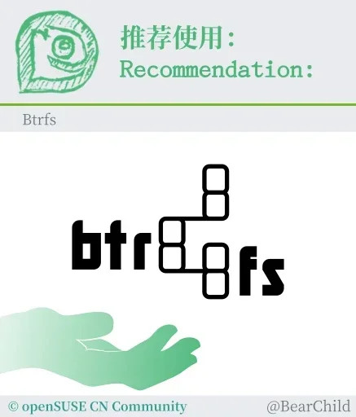

## 缘起

最近主力laptop上面的Arch根目录余量一直在1.5GiB上下徘徊，
今天滚完之后`/`仅剩的900+MB 已经不能完成Arch的每日一滚了

因为我在安装这个Arch的时候使用了固定的分区方式，
而且根目录只分配了20GB, 安装使用桌面作业系统的话，
很轻松就可以吃光这点空间

之前的分区方式大概如下表

```txt
/dev/nvme0n1---
             |
             --- partation1 - /root(ext4, 20G)
             |
             --- partation2 - /home(f2fs, 460G)
```

不幸的是我在使用的磁盘里面没有留下空余的未分配空间给根目录分区扩充，
比较好的方法是重装整个OS

如果不干预的话， 我的开发环境会在不远的将来boom掉

那么事不宜迟， 开工！

> 在求教c10s之后，她扔出了如下表情


嗯。。被强烈安利了btrfs

之前也有听过btrfs这个东东，但是~~因为懒~~还没有用过

在Archwiki找到btrfs的[wikipage](https://wiki.archlinux.org/title/Btrfs)
发现自带很多高级的功能 例如逻辑卷管理、快照、RAID ...etc.

> Btrfs is a modern copy on write (CoW) filesystem for Linux aimed at implementing advanced features while also focusing on fault tolerance, repair and easy administration. Jointly developed at multiple companies, Btrfs is licensed under the GPL and open for contribution from anyone.

看起来很好耶，上车！

> Tips: btrfs的开发十分活跃， 建议使用最新的内核，尽量避免使用祖传的老版本内核以得到最佳的体验

## 创建文件系统

先在磁盘上面创建一个btrfs的文件系统
` sudo mkfs.btrfs -L mylabel /dev/nvme0n1p2 `

btrfs也可以以霸占整个磁盘的方式进行使用， 此时这个磁盘的分区表就由btrfs接管了

因为我还需要ESP partation来使用UEFI启动， 就不可以使用这种方式

这里我的磁盘是分好了区的， 一个2GB的FAT32分区来实现UEFI启动 剩下的所有空间给btrfs

操作到这一步， 已经可以继续下一步往这些文件系统上面安装系统了

但是， 这样使用btrfs不能用上它的许多高级功能
此时如果直接挂载这个分区的话， 可以享受到btrfs的CoW(写时复制) 特性来减少闪存设备的损耗，可以启用压缩、、类似的优势

继续操作， 需要使用用户空间的btrfs工具`btrfs-progs`
在ArchLinux上面要安装它，只需
`sudo pacman -S btrfs-progs`

## btrfs子卷

创建好btrfs文件系统之后， 就拥有了一个`ID=5`的顶级子卷

创建一个空闲的目录(例如`/btrfs`) 把文件系统的顶级子卷挂上，
就可以用 `btrfs subvolume create /path/to/subvolume`来创建子卷

这里， 我为`/root, /home, /swap`这三个目录在顶级子卷下面创建了三个子卷

```bash
btrfs subvoleme create /btrfs/subvol_root
btrfs subvolume create /btrfs/subvol_home

```

Archwiki推荐为swap文件单独创建一个子卷直属于顶级子卷的子卷来挂载:
`btrfs subvolume create /btrfs/@swap`

btrfs-progs 6.1版本之后，提供了一个直接创建swap文件的命令:
`btrfs filesystem mkswapfile --size 8g /btrfs/@swap/swapfile`

可以通过`--size`来定义创建的缓存文件的大小，这样创建出来的swap文件就可以直接挂载了～

通过`btrfs subvolume list -p /mnt` 可以列出文件系统下面的子卷

```txt
ID 256 gen 10069 parent 5 top level 5 path subvol_root
ID 257 gen 10069 parent 5 top level 5 path subvol_home
ID 258 gen 9195 parent 5 top level 5 path @swap
ID 259 gen 17 parent 256 top level 256 path subvol_root/var/lib/portables
ID 260 gen 18 parent 256 top level 256 path subvol_root/var/lib/machines
```

上面是我的子卷列表

## 挂载

在挂载的时候加上`subvol=/path/to/subvolume`或者`subvolid=?`，btrfs子卷就可以像文件系统分区一样被挂载

推荐创建一个子卷来挂载根目录，这样会为以后更改子卷布局和快照带来非常大的便利

我添加了`autodefrap`自动除碎片， `compress=zstd`启用zstd压缩方式，`discard=async`启用SSD-TRIM 三个参数

因为是在安装过程中操作， 挂载的选项都会被`genfstab`自动插到`/etc/fstab`当中

我的`/etc/fstab`如下:

```txt
# /dev/nvme0n1p2 LABEL=Arch
UUID=efeb8313-4210-4499-a805-d0f97e57c549 /          btrfs      rw,relatime,compress=zstd:3,ssd,discard=async,space_cache=v2,autodefrag,subvolid=256,subvol=/subvol_root 0 0

# /dev/nvme0n1p1
UUID=45BB-F7D1       /boot      vfat       rw,relatime,fmask=0022,dmask=0022,codepage=437,iocharset=ascii,shortname=mixed,utf8,errors=remount-ro 0 2

# /dev/nvme0n1p2 LABEL=Arch
UUID=efeb8313-4210-4499-a805-d0f97e57c549 /home      btrfs      rw,relatime,compress=zstd:3,ssd,discard=async,space_cache=v2,autodefrag,subvolid=257,subvol=/subvol_home 0 0

# /dev/nvme0n1p2 LABEL=Arch
UUID=efeb8313-4210-4499-a805-d0f97e57c549 /swap      btrfs      rw,relatime,compress=zstd:3,ssd,discard=async,space_cache=v2,autodefrag,subvolid=258,subvol=/@swap 0 0

/swap/swapfile       none       swap       defaults   0 0
```

## 检查文件系统错误

没有效验的文件系统，文件损坏是无声发生的

btrfs提供了`scrub`来进行在线的文件系统检查

BtrfsWiki这样写道：
> Btrfs scrub is "[a]n online filesystem checking tool. Reads all the data and metadata on the filesystem and uses checksums and the duplicate copies from RAID storage to identify and repair any corrupt data."

挂上文件系统的根目录进行一次扫描操作: `sudo btrfs scrub start /`

查看进度: `sudo btrfs scrub status /`

```txt
UUID:             efeb8313-4210-4499-a805-d0f97e57c549
Scrub started:    Sun Mar 12 19:53:53 2023
Status:           running
Duration:         0:00:05
Time left:        0:00:14
ETA:              Sun Mar 12 19:54:16 2023
Total to scrub:   93.21GiB
Bytes scrubbed:   24.29GiB  (26.06%)
Rate:             4.86GiB/s
Error summary:    no errors found
```

扫描只用了14秒， 非常快！

## End

我也是刚刚上手btrfs, 如果有小可爱有更好的建议或者发现哪里出错了，欢迎评论 or 提出PR~
